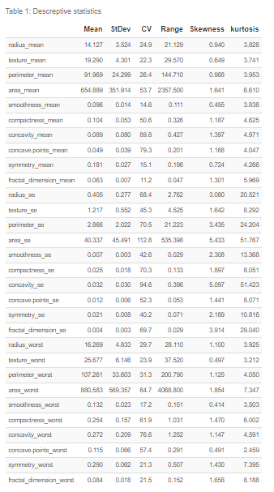
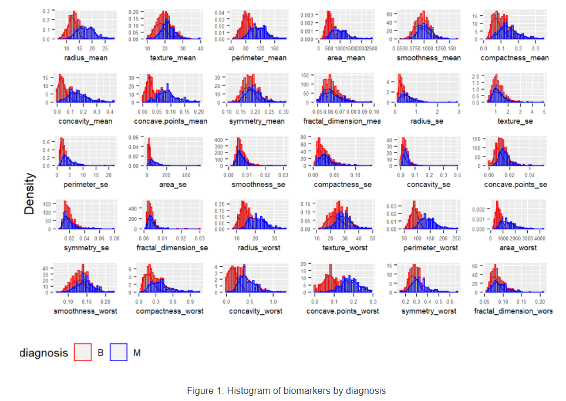
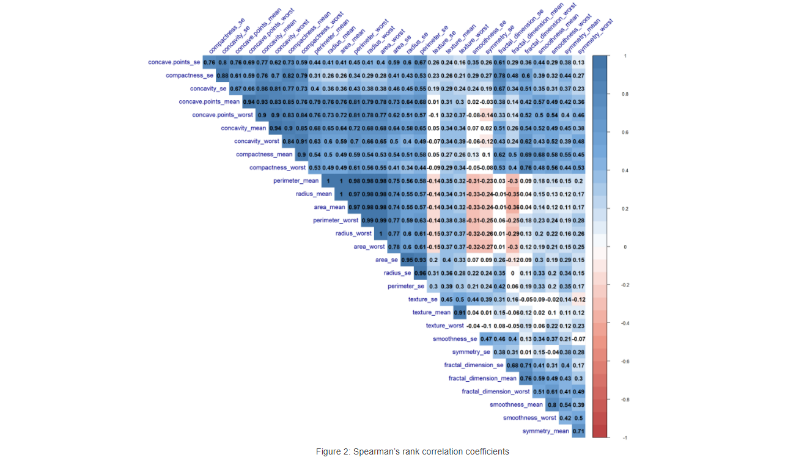
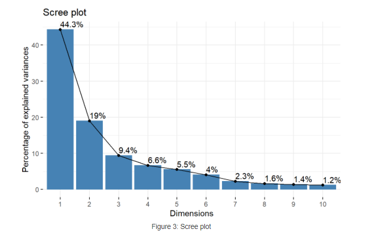
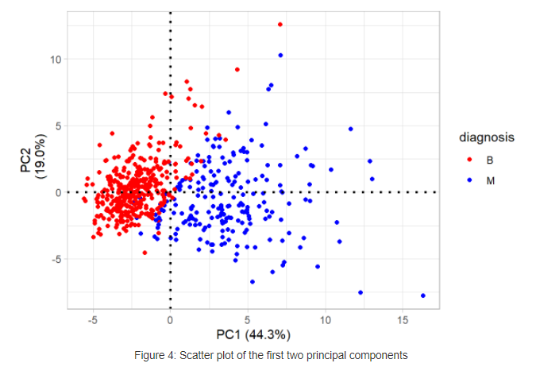

1.Objectives

Objective of this task is to derive a cutoff of one of the features and to find a combination of potentially diagnostic variables for the identification of benign vs. malignant 
tumors.

2.Dataset

The dataset consists of 569 examples of breast cancer biopsies. Each example has 32 variables. Out of the 32 variables, 30 are continuous features(biomarkers), one is an 
identification number, and the other is diagnosis. The diagnosis outcome is coded as “M” to indicate the tumor is malignant and as “B” to indicate the tumor is benign.
3.Exploratory Data Analysis(EDA)
Exploratory analysis was performed to describe the centrality, variability, and distributional behavior of the biomarkers. The mean was used as a measurement of central 
tendency, the standard deviation, range, and the coefficient of variation(CV) were used as measurements of variation, and skewness and kurtosis were used as measurements of
distribution shape. Also, as part of data exploration histogram of each biomarker by diagnosis (M vs. B) was visualized.
3.1.1.Summary Statistics

Descreptive statistics

Histogram of Biomarkers

According to the CV values, area_se (standard error of area), concavity_se(standard error of concavity), and concavity_mean(mean concavity) have the highest relative dispersion compared to other biomarkers.
 For a variable that has a perfect normal distribution, the skewness is 0 and the kurtosis is 3. From the values of skewness and kurtosis presented in Table 1, all biomarkers have distributions that are deviated from a normal distribution. However, their level of the deviations are different. For example, area_se (standard error of area) has a distribution that least resembles a normal distribution (skewness = 5.433 and kurtosis = 51.767). The biomarker that has the most close to normal distribution is smoothness_worst(skewness =0.414 and Kurtosis = 3.503). The histograms in Figure 1 also showed the deviations of the distributions of biomarkers from a normal distribution for malignant and benign tumors separately.
 
 4.Correlation Between Biomarkers
 
 One important step in predicting a certain outcome is analyzing the relationship between between features. This helps to see if candidate predictors are correlated or if they contain redundant information. To assess the relationship between biomarkers the Spearman’s rank correlation coefficients were calculated.
 
 

Pearson correlation coefficient is best when two variables have a bivariate normal distribution which seems less logical to assume for the biomarkers we have considering the results presented in the previous section. One alternative is to apply non-parametric methods such as Spearman’s rank correlation. As presented in Figure 3, there is strong correlation between features that represent area, diameter, perimeter, and concave points. The minimum observed pairwise correlation between them is 0.4. In the heatmap, uncolored cells represents correlation values that are not significantly different from zero at 1% level of significance.

4.1.1. Comparing Means of Biomarkers by Diagnosis

T-test mean of biomarkers by diagnosis

T-test was used to determine if the mean biomarker values for malignant and benign tumors are statistically equal. Since the sample size is large (>30) the distribution of the t-test statistic will have approximately a normal distribution as given by the Central Limit Theorem(CLT) irrespective of the distribution of the population. The result of the t-test is presented in Table 2. At a 1% level of significance, the mean values for malignant and benign tumors are not significantly different for only four of the biomarkers: fractal_dimension_mean, fractal_dimension_se, texture_se, smoothness_se, and symmetry_se.

4.1.2.Principal Component Analysis(PCA)
PCA was used to further explore the relationship between biomarkers. After applying PCA, the relationship between principal components and biomarkers was analyzed to identify biomarkers that are correlated each other most and biomarkers that contributed most to the total observed variation.

4.1.3.Relationship Between Biomarkers and Principal Components

As presented in Figure 4, the first Principal Component (PC) accounts for 44.3% of variance from the original set of biomarkers. Similarly, all subsequent orthogonal components account for the maximum proportion of the remaining variance. Usually the orthogonal components of PCA doesn’t help in searching features that best predict a certain outcome variable. This is mainly because PCA do the transformation irrespective of the outcome variable. However for breast cancer biomarkers, the orthogonal components magnified the boundaries between malignant and benign groups, see Figure 5.
Figure 6 presents the relationship between biomarkers and features. It was computed by taking the dot product of features and orthogonal components. The figure tells which biomarkers contributed for which principal component. For example, the five major contributors of the first principal are: concave.points_mean, concave.points_worst, concavity_mean, perimeter_worst, and compactness_mean.
