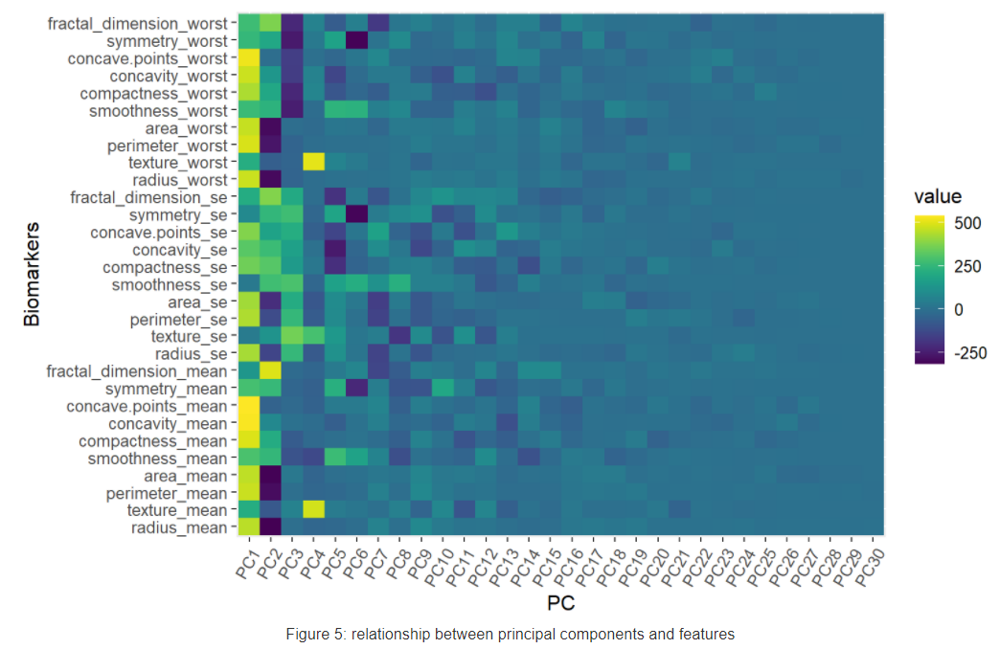

1.Objectives

Objective of this task is to derive a cutoff of one of the features and to find a combination of potentially diagnostic variables for the identification of benign vs. malignant 
tumors.

2.Dataset

The dataset consists of 569 examples of breast cancer biopsies. Each example has 32 variables. Out of the 32 variables, 30 are continuous features(biomarkers), one is an 
identification number, and the other is diagnosis. The diagnosis outcome is coded as “M” to indicate the tumor is malignant and as “B” to indicate the tumor is benign.
3.Exploratory Data Analysis(EDA)
Exploratory analysis was performed to describe the centrality, variability, and distributional behavior of the biomarkers. The mean was used as a measurement of central 
tendency, the standard deviation, range, and the coefficient of variation(CV) were used as measurements of variation, and skewness and kurtosis were used as measurements of
distribution shape. Also, as part of data exploration histogram of each biomarker by diagnosis (M vs. B) was visualized.
3.1.1.Summary Statistics

Descreptive statistics

Histogram of Biomarkers

According to the CV values, area_se (standard error of area), concavity_se(standard error of concavity), and concavity_mean(mean concavity) have the highest relative dispersion compared to other biomarkers.
 For a variable that has a perfect normal distribution, the skewness is 0 and the kurtosis is 3. From the values of skewness and kurtosis presented in Table 1, all biomarkers have distributions that are deviated from a normal distribution. However, their level of the deviations are different. For example, area_se (standard error of area) has a distribution that least resembles a normal distribution (skewness = 5.433 and kurtosis = 51.767). The biomarker that has the most close to normal distribution is smoothness_worst(skewness =0.414 and Kurtosis = 3.503). The histograms in Figure 1 also showed the deviations of the distributions of biomarkers from a normal distribution for malignant and benign tumors separately.
 
 4.Correlation Between Biomarkers
 
 One important step in predicting a certain outcome is analyzing the relationship between between features. This helps to see if candidate predictors are correlated or if they contain redundant information. To assess the relationship between biomarkers the Spearman’s rank correlation coefficients were calculated.
 
 

Pearson correlation coefficient is best when two variables have a bivariate normal distribution which seems less logical to assume for the biomarkers we have considering the results presented in the previous section. One alternative is to apply non-parametric methods such as Spearman’s rank correlation. As presented in Figure 3, there is strong correlation between features that represent area, diameter, perimeter, and concave points. The minimum observed pairwise correlation between them is 0.4. In the heatmap, uncolored cells represents correlation values that are not significantly different from zero at 1% level of significance.

4.1.1. Comparing Means of Biomarkers by Diagnosis

T-test mean of biomarkers by diagnosis

T-test was used to determine if the mean biomarker values for malignant and benign tumors are statistically equal. Since the sample size is large (>30) the distribution of the t-test statistic will have approximately a normal distribution as given by the Central Limit Theorem(CLT) irrespective of the distribution of the population. The result of the t-test is presented in Table 2. At a 1% level of significance, the mean values for malignant and benign tumors are not significantly different for only four of the biomarkers: fractal_dimension_mean, fractal_dimension_se, texture_se, smoothness_se, and symmetry_se.

4.1.2.Principal Component Analysis(PCA)
PCA was used to further explore the relationship between biomarkers. After applying PCA, the relationship between principal components and biomarkers was analyzed to identify biomarkers that are correlated each other most and biomarkers that contributed most to the total observed variation.

4.1.3.Relationship Between Biomarkers and Principal Components

As presented in Figure 4, the first Principal Component (PC) accounts for 44.3% of variance from the original set of biomarkers. Similarly, all subsequent orthogonal components account for the maximum proportion of the remaining variance. Usually the orthogonal components of PCA doesn’t help in searching features that best predict a certain outcome variable. This is mainly because PCA do the transformation irrespective of the outcome variable. However for breast cancer biomarkers, the orthogonal components magnified the boundaries between malignant and benign groups, see Figure 5.
Figure 6 presents the relationship between biomarkers and features. It was computed by taking the dot product of features and orthogonal components. The figure tells which biomarkers contributed for which principal component. For example, the five major contributors of the first principal are: concave.points_mean, concave.points_worst, concavity_mean, perimeter_worst, and compactness_mean.

5.Modeling Diagnosis Outcome

Two models were developed to be able to recognize the type of the tumor based on biomarkers or features generated from them. The first fitted model is Generalized Linear Model(GLM) and the second model is Random Forest(RF) model. First, the dataset was split as 70% train and 30% test set. For the GLM collinearities between biomarkers were assessed by computing VIF and Tolerance.

5.1.1.Checking the Presence of Multicollinearity

As presented in Table 3, all the VIF values are greater than 10. A VIF value that exceeds 10 indicates the presence of multicollinearity. This is an issue especially for models such as Linear Models (LM) and Generalized Linear Models(GLM). In such cases, the two commonly used approaches are: (1) to drop some of the features, and (2) create orthogonal features by applying methods such as PCA. For the GLM model, PCA components were used as features.

5.2.Fitting Logistic Regression

The VIF and Tolerance values showed the presence of strong collinearity between biomarkers. For the GLM, the presence of multicollinearity causes unstable estimates and inaccurate standard errors which affects confidence intervals and hypothesis tests. For this reason, for logistic regression, the first five components of PCA are used instead of the original biomarkers.
<pre>
## 
## Call:
## glm(formula = factor(diagnosis_numeric) ~ ., family = binomial(link = "logit"), 
##     data = TrainData_PCA[, c(1:5, 31)])
## 
## Deviance Residuals: 
##    Min      1Q  Median      3Q     Max  
## -1.752  -0.041  -0.005   0.001   3.610  
## 
## Coefficients:
##             Estimate Std. Error z value Pr(>|z|)    
## (Intercept)   -0.382      0.371   -1.03  3.0e-01    
## PC1            3.005      0.553    5.44  5.4e-08 ***
## PC2           -1.589      0.369   -4.30  1.7e-05 ***
## PC3           -0.418      0.206   -2.03  4.2e-02 *  
## PC4            0.747      0.289    2.58  9.9e-03 ** 
## PC5            1.182      0.486    2.43  1.5e-02 *  
## ---
## Signif. codes:  0 '***' 1e-03 '**' 1e-02 '*' 5e-02 '.' 0.1 ' ' 1
## 
## (Dispersion parameter for binomial family taken to be 1)
## 
##     Null deviance: 527.285  on 398  degrees of freedom
## Residual deviance:  55.241  on 393  degrees of freedom
## AIC: 67.24
## 
## Number of Fisher Scoring iterations: 9
</pre>

5.2.2.Performance of the Logistic Regression Model

## Confusion Matrix and Statistics
## 
##           Reference
## Prediction   0   1
##          0 104   3
##          1   2  61
##                                        
##                Accuracy : 0.971        
##                  95% CI : (0.933, 0.99)
##     No Information Rate : 0.624        
##     P-Value [Acc > NIR] : <2e-16       
##                                        
##                   Kappa : 0.937        
##                                        
##  Mcnemar's Test P-Value : 1            
##                                        
##             Sensitivity : 0.953        
##             Specificity : 0.981        
##          Pos Pred Value : 0.968        
##          Neg Pred Value : 0.972        
##              Prevalence : 0.376        
##          Detection Rate : 0.359        
##    Detection Prevalence : 0.371        
##       Balanced Accuracy : 0.967        
##                                        
##        'Positive' Class : 1            
## 
 
Since logistic regression assumes weak or no correlation between predictors, the first five principal components are used. The first five principal components account for 84.8% of the total variation. The results of the model summary indicated that, at a 1% level of significance the coefficients of all the five principal components are significantly different from zero. Also, the model performance summary indicated that the fitted logistic regression correctly classified 97.1% of the cases. It was also able to identify 95.3% of true malignant tumor cases and 98.1% of true benign tumor cases.

5.3.Fitting Random Forest Model
Unlike the LM and GLM models, the random forest doesn’t expect the features to be uncorrelated. For this reason and to directly engage with the original content, biomarkers as they are given were used. The importance of features is analyzed to make the model less complex and to rank the biomarkers based on their importance. The final model is fitted using 15 (50%) of the available features.

5.3.1.Feature Importance Random Forest Model

5.3.2.Evaluating the Performance of the RF Model
## Confusion Matrix and Statistics
## 
##           Reference
## Prediction  0  1
##          0 99  8
##          1  3 60
##                                         
##                Accuracy : 0.935         
##                  95% CI : (0.887, 0.967)
##     No Information Rate : 0.6           
##     P-Value [Acc > NIR] : <2e-16        
##                                         
##                   Kappa : 0.864         
##                                         
##  Mcnemar's Test P-Value : 0.228         
##                                         
##             Sensitivity : 0.882         
##             Specificity : 0.971         
##          Pos Pred Value : 0.952         
##          Neg Pred Value : 0.925         
##              Prevalence : 0.400         
##          Detection Rate : 0.353         
##    Detection Prevalence : 0.371         
##       Balanced Accuracy : 0.926         
##                                         
##        'Positive' Class : 1             
## 

Summary of the random forest performance metrics indicated that the model correctly classified 93.5% of the cases for the test set. The model was also able to recognize 88.2% of the true malignant tumor cases and 97.1% of benign tumor cases. According to the feature importance, biomarkers related to the size of the tumor such as area, perimeter, concave points, radius are more important.

6.Deriving Cutoff for the Mean Area
6.1.1.Distribution of Mean Area by Diagnosis

